# hse_hw1_meth


○	SRR5836473 - 8 Cell

○	SRR3824222 - Epiblast

○	SRR5836475 - ICM


Сылка на Google Collab: https://colab.research.google.com/drive/1M4if3EnAGD5LTrbSNl7U73l1czCW0k-Y?hl=ru#scrollTo=b9Pfcq4ZYb_T

Задание #1
=====================

### Per Base Sequence Content

Ссылка:https://www.bioinformatics.babraham.ac.uk/projects/fastqc/Help/3%20Analysis%20Modules/4%20Per%20Base%20Sequence%20Content.html


Данные SRR5836475
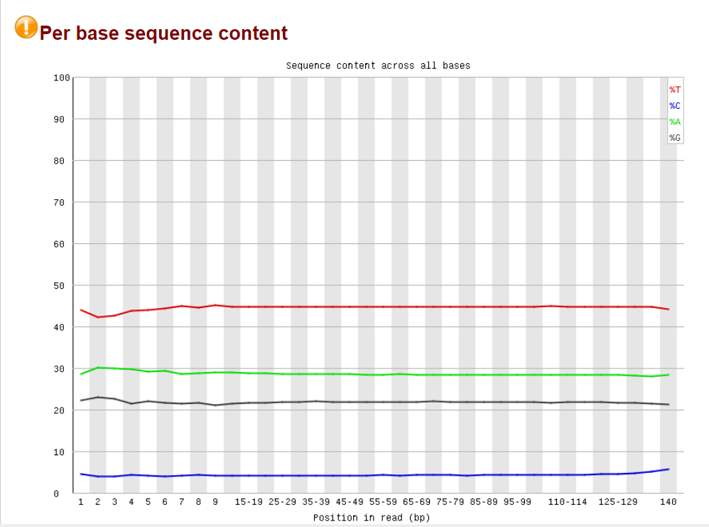

Данные SRR3414629
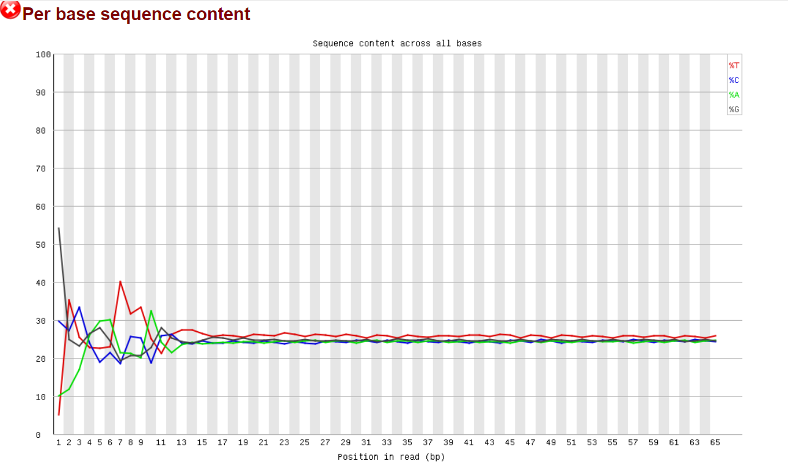

### Per Sequence GC Content

Ссылка:https://www.bioinformatics.babraham.ac.uk/projects/fastqc/Help/3%20Analysis%20Modules/5%20Per%20Sequence%20GC%20Content.html

Данные SRR5836475
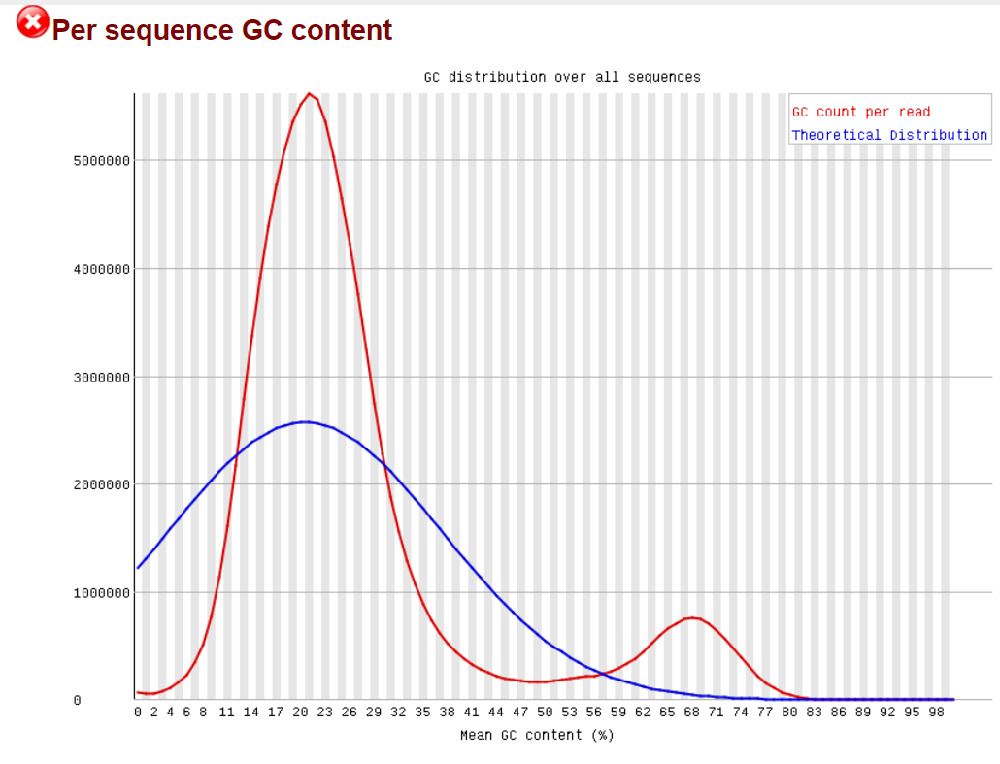

Данные SRR3414629
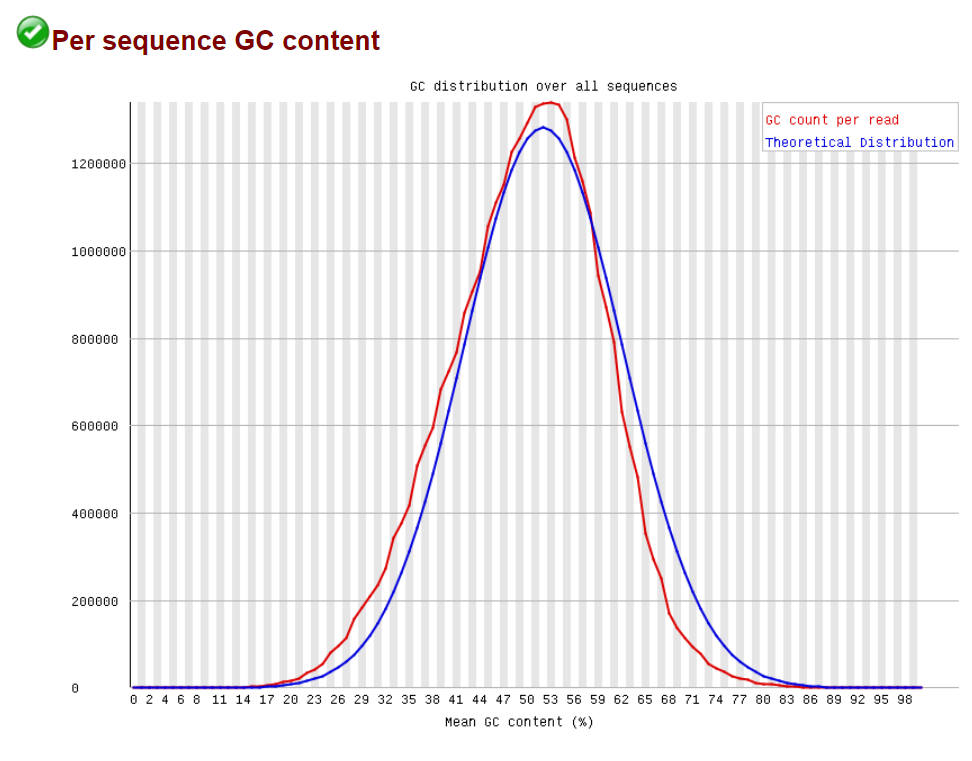

### Sequence Length Distribution

Ссылка:https://www.bioinformatics.babraham.ac.uk/projects/fastqc/Help/3%20Analysis%20Modules/7%20Sequence%20Length%20Distribution.html

Данные SRR5836475
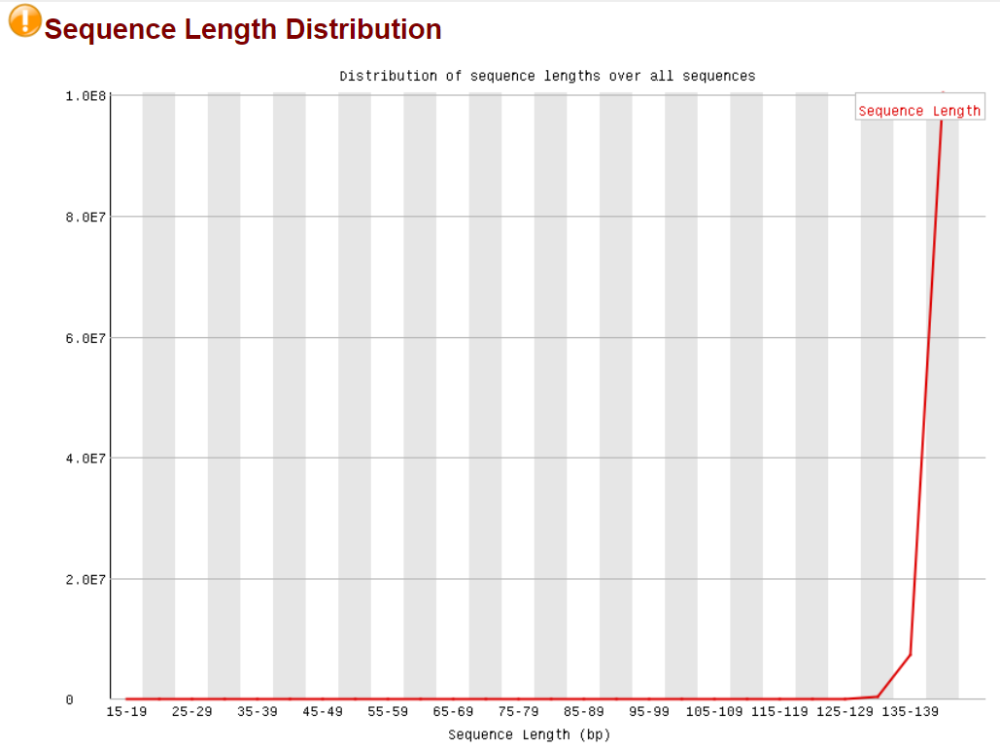

Данные SRR3414629
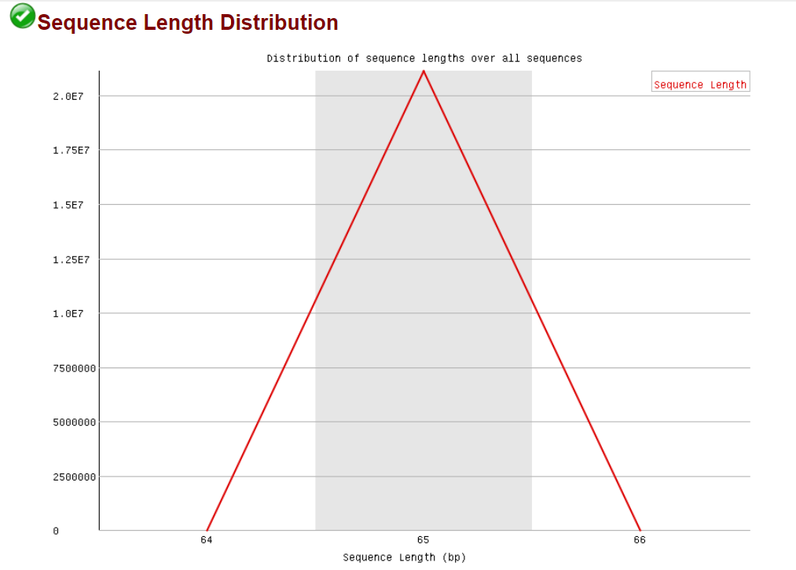

### Duplicate Sequences

Ссылка:https://www.bioinformatics.babraham.ac.uk/projects/fastqc/Help/3%20Analysis%20Modules/8%20Duplicate%20Sequences.html

Данные SRR5836475
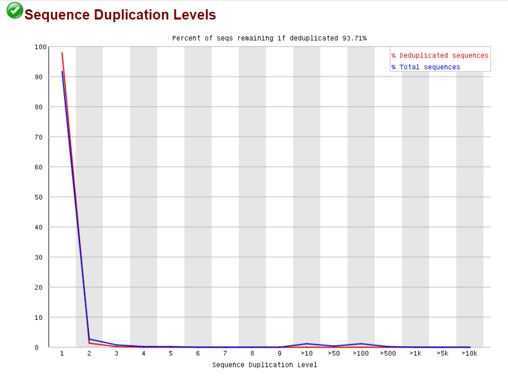

Данные SRR3414629
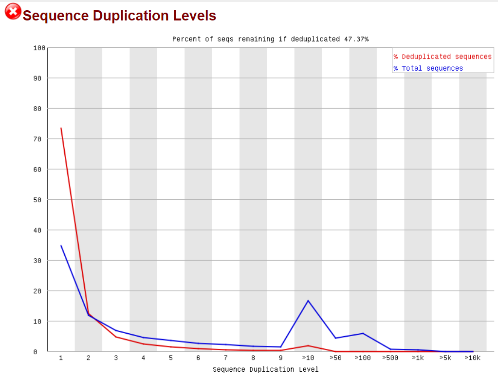


Задание #2
=====================


### Пункт а
Работа с bam-files с выравниваниями BS-seq ридов на 11-ю хромосому мыши

Ниже представлена сводная таблица с числом ридов, закартированных на участки
1) 11347700-11367700
2) 40185800-40195800

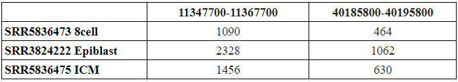


### Пункт b
Результаты дедупликации файлов выравниваний (в %).

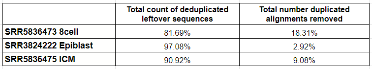

Скрипт для выполнения дедупликации для всех образцов одновременно:
! ls SRR5836475_1_bismark_bt2_pe.bam SRR3824222_1_bismark_bt2_pe.bam SRR5836473_1_bismark_bt2_pe.bam | xargs -P 3 -tI{} deduplicate_bismark  --bam  --paired  -o s_{} {}
#### Результат:
.......

Total number of alignments analysed in SRR5836473_1_bismark_bt2_pe.bam:	2850231
Total number duplicated alignments removed:	521904 (18.31%)
Duplicated alignments were found at:	230432 different position(s)
Total count of deduplicated leftover sequences: 2328327 (81.69% of total)


Total number of alignments analysed in SRR5836475_1_bismark_bt2_pe.bam:	4159998
Total number duplicated alignments removed:	377882 (9.08%)
Duplicated alignments were found at:	229833 different position(s)
Total count of deduplicated leftover sequences: 3782116 (90.92% of total)


Total number of alignments analysed in SRR3824222_1_bismark_bt2_pe.bam:	7039016
Total number duplicated alignments removed:	205258 (2.92%)
Duplicated alignments were found at:	164796 different position(s)
Total count of deduplicated leftover sequences: 6833758 (97.08% of total)

.......


### Пункт c
Сделано в Google Collab 


### Пункт d
Отчеты html находятся в папаке html. 

Ниже разберем M-bias plot.

График смещения метилирования показывает долю метилирования в каждой возможной позиции в считывании. Данный график полезен для контроля качества. При хороших показателях уровень метилирования должен быть почти постоянным. В обратном случае необходимо перепроверить данные.


#### Ссылки на источники:
https://sequencing.qcfail.com/articles/library-end-repair-reaction-introduces-methylation-biases-in-paired-end-pe-bisulfite-seq-applications/

https://www.biostars.org/p/259801/

https://www.bioinformatics.babraham.ac.uk/projects/bismark/Bismark_User_Guide.pdf

На всех образцах можно отметить, что в Read 1 уровень метилирования практически постоянный, следовательно данные в норме.

Однако, Read 2 имеет некоторые артефакты. Так на конце 3' наблюдается смещение.

#### №1 SRR5836473 - 8 Cell

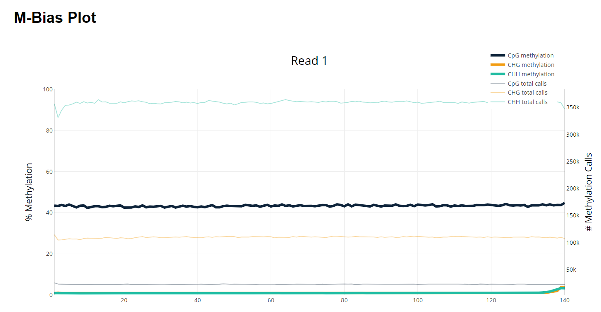
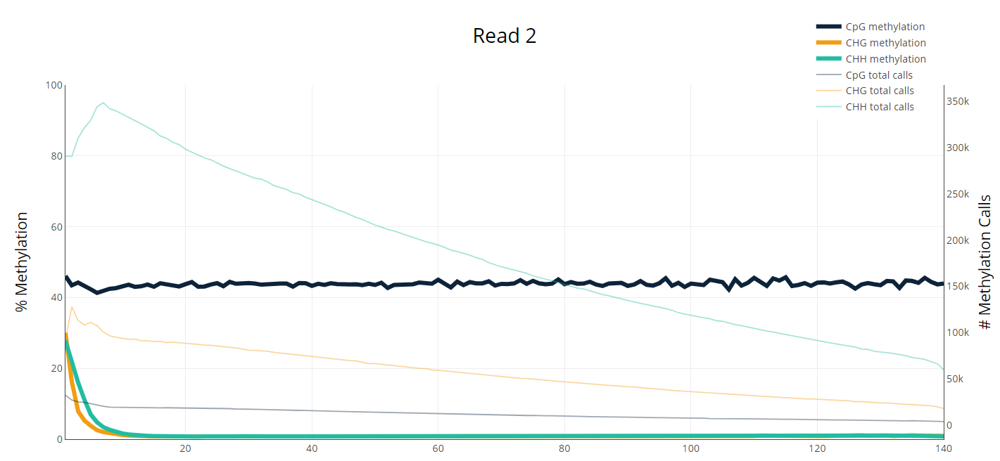

#### №2 SRR3824222 - ICM

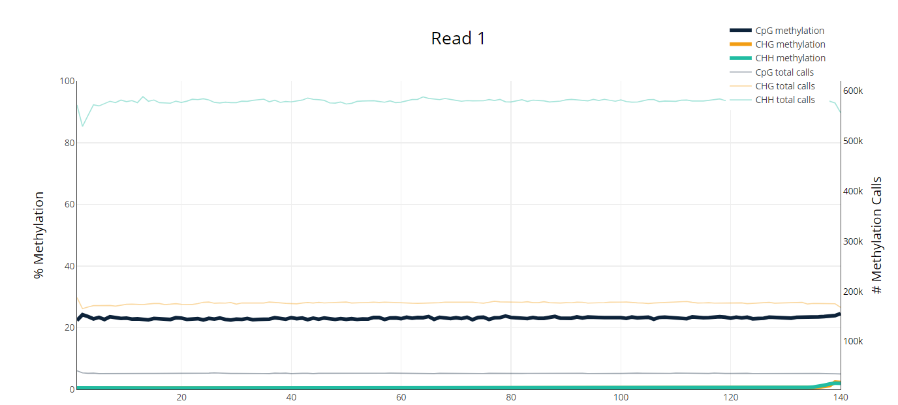
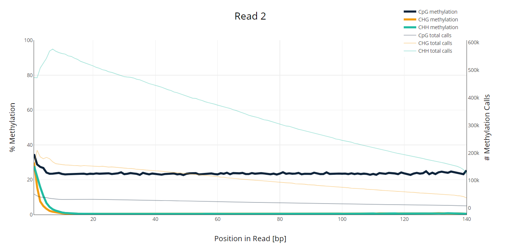

#### №3 SRR3824222 - Epiblast

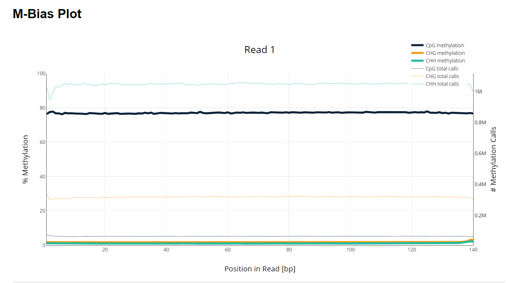
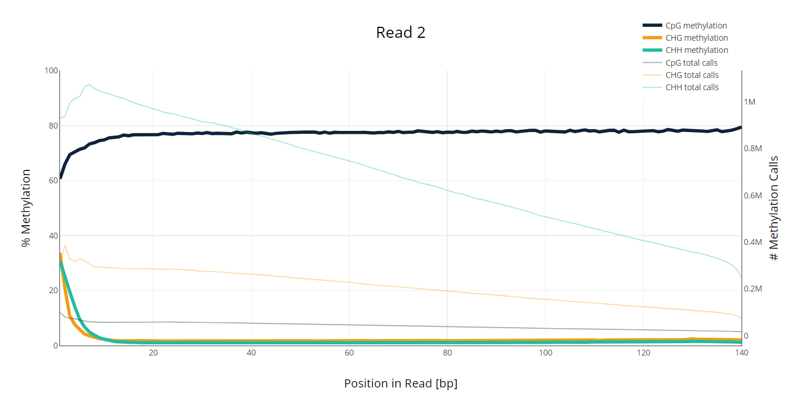


### Пункт e

#### №1 SRR5836473 - 8 Cell

```python
import matplotlib.pyplot as plt
import pandas as pd
file_name = pd.read_csv("s_8_cell.deduplicated.bedGraph", delimiter='\t', skiprows=1, header=None)
plt.figure(figsize=[10, 5])
plt.title("Гистограмму распределения метилирования цитозинов по хромосоме 8cell", fontsize=15)
plt.xlabel("Процент метилированных цитозинов")
plt.ylabel("Частота")
plt.hist(file_name[3], bins=50, density=True)
plt.show()
```
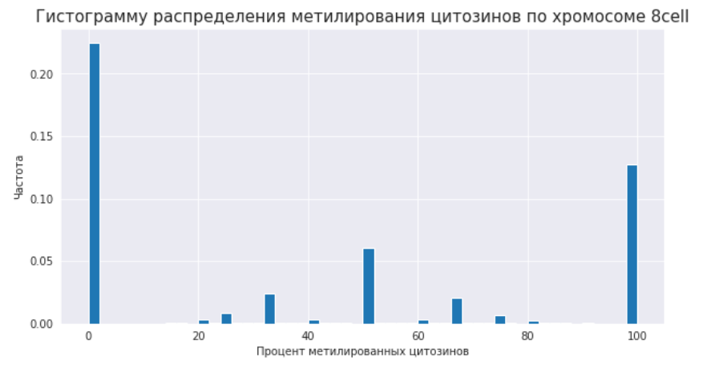

#### №2 SRR3824222 - ICM
```python
import matplotlib.pyplot as plt
import pandas as pd
file_name = pd.read_csv("s_ICM.deduplicated.bedGraph", delimiter='\t', skiprows=1, header=None)
plt.figure(figsize=[10, 5])
plt.title("Гистограмму распределения метилирования цитозинов по хромосоме ICM", fontsize=15)
plt.xlabel("Процент метилированных цитозинов")
plt.ylabel("Частота")
plt.hist(file_name[3], bins=50, density=True)
plt.show()
```
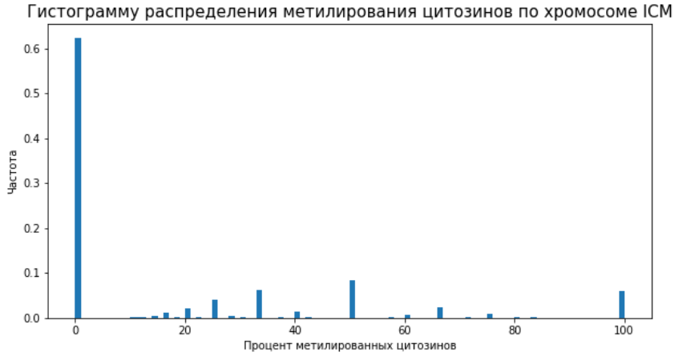

#### №3 SRR3824222 - Epiblast
```python
import matplotlib.pyplot as plt
import pandas as pd
file_name = pd.read_csv("s_Epiblast.deduplicated.bedGraph", delimiter='\t', skiprows=1, header=None)
plt.figure(figsize=[10, 5])
plt.title("Гистограмму распределения метилирования цитозинов по хромосоме Epiblast", fontsize=15)
plt.xlabel("Процент метилированных цитозинов")
plt.ylabel("Частота")
plt.hist(file_name[3], bins=50, density=True)
plt.show()
```
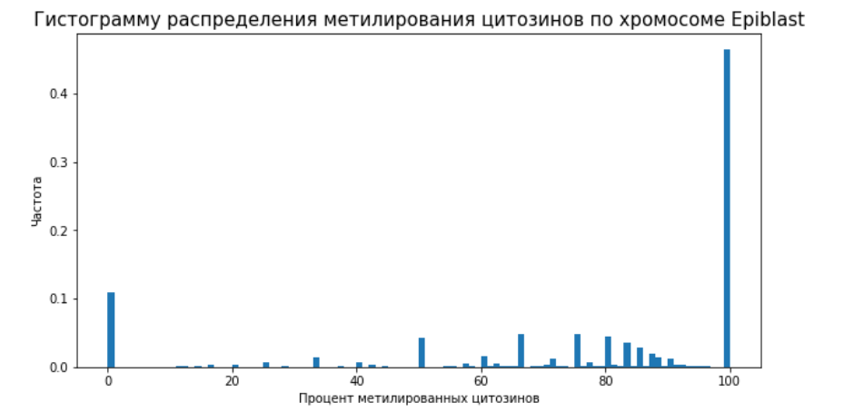


#### ВЫВОДЫ

●	8cell – 8-клеточный эмбрион, примерно 2.25 дня после оплодотворения яйцеклетки
●	ICM – внутренняя клеточная масса бластоциста, примерно 3.5 дня после оплодотворения яйцеклетки
●	Epiblast – стадия эпибласта, примерно 6.5 дней после оплодотворения яйцеклетки
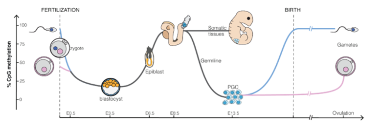

Так как 8cell является первой стадией развития эмбриона, то уровень метилирования средний на всём участке.

Далее идёт ICM, на котором уровень ниже чем в 8cell, а также заметен резкий спад

Последняя - Epiblast, в которой уровень метилирования примерно также как и в 8 cell, а также идет возрастание метилирование.
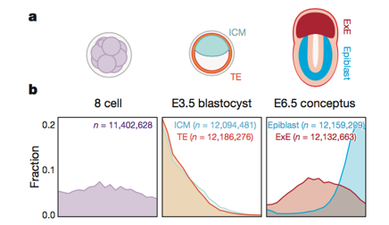


### Пункт f
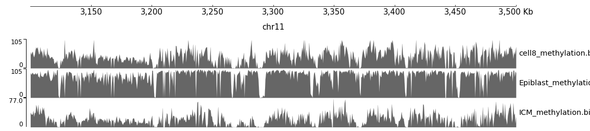


